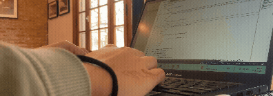

<!--<a href="#english_presentation">EN version</a> -->

<div align="center">


<h3>Estudiante en Programación Informática | Junior Developer</h3>

<p align="center">
  
</p>


</div>

<!-- sobre mi -->
<div id="sobre-mi">
<h4>🙋‍♀️Mi nombre es Martina :</h4>
<ul>
    <li>💻 Junior Developer en formación (Front-end).  </li>
    <li> 📚 Estudiando Programación Informática en la universidad.</li>
    <li>🌱 Autodidacta: aprendiendo HTML, CSS, JavaScript y React.  </li>
    <li>🚀 Buscando mi primera experiencia laboral en IT. </li>
    <li>🔍 Me interesa crear proyectos simples, útiles y bien estructurados. </li>
    <li>🤝 Abierta a colaborar y aprender en equipo. </li>
    <li>🌎 Argentina-chilena, curiosa por la tecnología y el aprendizaje constante. </li>
</ul>

<p align="center">
  
</p>

</div>

<!-- tech stack -->
<div id="tech-stack" align="center">

<h4>Tech Stack </h4>

<p> 
<a href="https://www.cprogramming.com/" target="_blank" rel="noreferrer">  </a> 
<a href="https://www.w3schools.com/css/" target="_blank" rel="noreferrer">  </a> 
<a href="https://www.w3.org/html/" target="_blank" rel="noreferrer">  </a> 
<a href="https://www.python.org" target="_blank" rel="noreferrer">  </a> 
</p>

<h4>Tools</h4>
<p>
<a href="https://code.visualstudio.com/" target="_blank" rel="nonreferrer"></a>
<a href="https://git-scm.com/" target="_blank" rel="nonreferrer"></a>
<a href="https://github.com/" target="_blank" rel="nonreferrer"></a>
<a href="https://www.arduino.cc/" target="_blank" rel="nonreferrer"></a>
</p>

</div>

<h4>🚀 Proyectos y estudios en curso</h4>


<!--START_SECTION:waka-->

```txt
Python       2 hrs 54 mins   ████████████████▓░░░░░░░░   67.01 %
JSON         52 mins         █████░░░░░░░░░░░░░░░░░░░░   19.94 %
JavaScript   16 mins         █▓░░░░░░░░░░░░░░░░░░░░░░░   06.31 %
CSS          15 mins         █▒░░░░░░░░░░░░░░░░░░░░░░░   05.84 %
Git Config   1 min           ░░░░░░░░░░░░░░░░░░░░░░░░░   00.49 %
```

<!--END_SECTION:waka-->


<div id="contact">
<p align="center">
  
</p>

<h4>Contáctame</h4>
<p align="left">
<a href="https://linkedin.com/in/martinaccwilich" target="blank"></a>
</p>

<p align="center">
  
</p>

</div>


